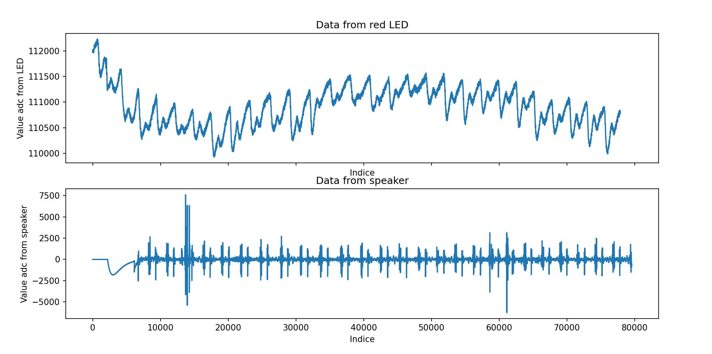
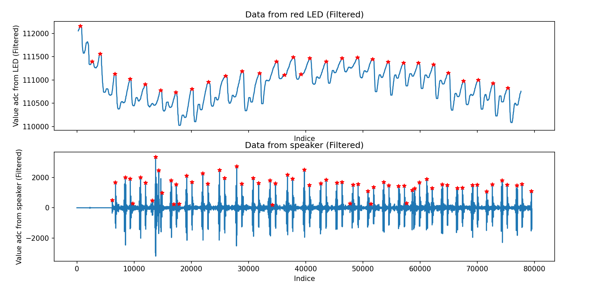

# 1. Các bước xử lý tín hiệu
- Đọc tín hiệu từ các file data PPG và PCG
- Với tín hiệu ppg được lấy mẫu với tần số fs_pcg = 250hz. Cho bộ lọc median cửa sổ 0.1*fs trượt trên tín hiệu ppg để làm mượt tín hiệu PPG.
- Với tín hiệu pcg được lấy mẫu với tần số fs_pcg = 4000hz. Cho bộ lọc thông dải có tần số cắt là [25: 120]hz làm lọc đi được các tín hiệu nhiễu có tần số thấp hơn 25hz và cao hơn 120hz.
- Do thiết bị của chúng tôi có sensor Max30102 đo sớm hơn sensor Inmp441 là 2300 mẫu. Vì vậy để đồng bộ data thì cần bỏ đi 2300 mẫu đầu tiên của Inmp441.
- Sau khi đã đc các tín hiệu lọc thì sẽ tín hành xác định các đỉnh của tín hiệu PPG và PCG.
 # 2. Kết quả
- Kết quả dữ liệu khi thu trước khi lọc và đã được đồng bộ được hiển thị dưới hình sau:

    
- Tín hiệu sau khi được lọc và xác định các đỉnh tín hiệu phục vụ cho việc tính huyết áp, spo2, nhịp tim được thể hiện như hình sau:
    